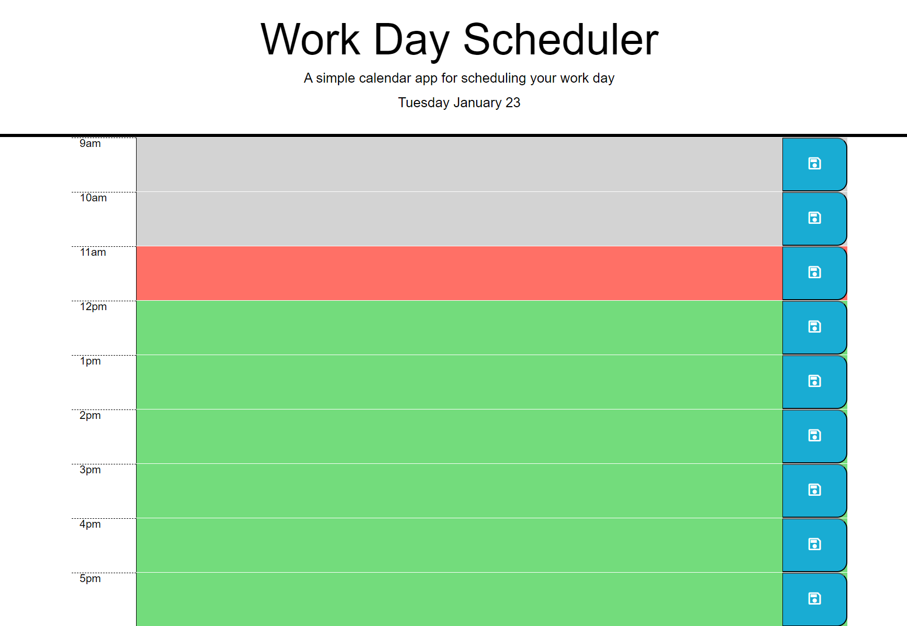
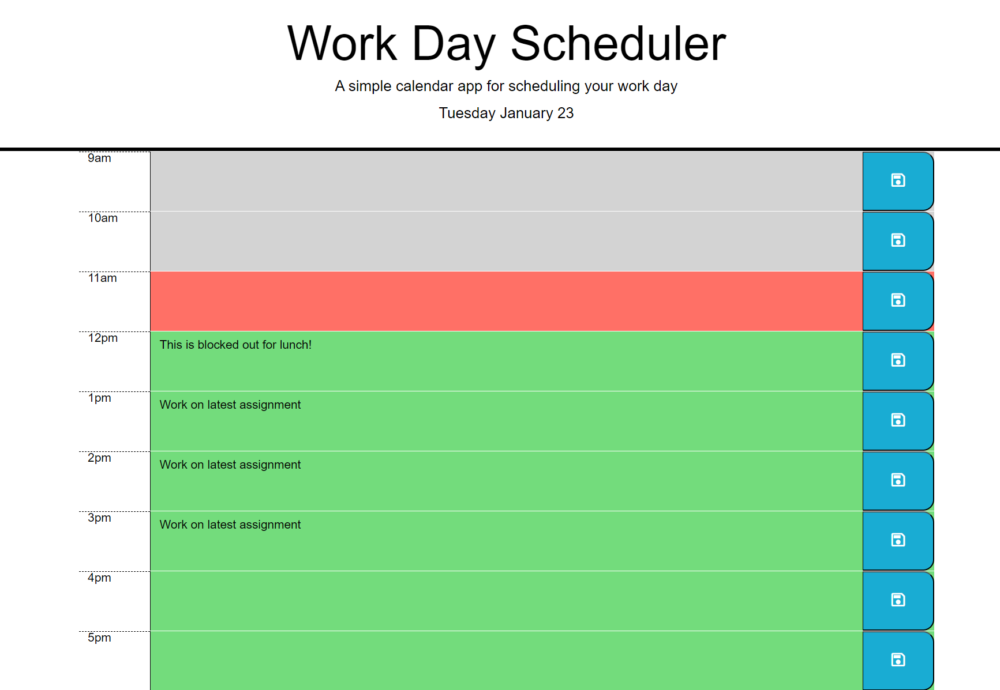

# Work Day Schedule

## Description

## Table of Contents
* [Links](#links)
* [Installation](#installation)
* [Usage](#usage)
* [Screenshots](#screenshots)
* [License](#license)
* [Features](#features)

## Links
- [Repo](https://github.com/cadbuckle/workdayschedule)
- [Live](https://cadbuckle.github.io/workdayschedule/)

## Installation
Saved data is held locally in the browser in a key called "wk07-Schedule".

## Usage 
The screen will display hourly time blocks from 9am up to and including 5pm.

Each row will be highlighted based upon it's time in relation to the current time. For future rows, they will be highlighted green. Past rows will be grey and the current row will be red.

Clicking the row in between the 9 and the Save icon will allow the user to enter text. Clicking the Save icon in the right hand column will save the details locally.

When the page is reloaded, any previously saved data will be displayed.

To delete an entry form a row, click in to the row, highlight all the text and then delete the text. Click save to record this.

## Screenshots
### Screenshot 1 - No items entered
</img>
### Screenshot 2 - Items entered
</img>

## License
MIT License as per repository.

## Features
JavaScript, notably:
- JQuery
- Dynamic highlighting of rows
- Local Storage: for recording the user's schedule.
- Google Font - for Save icon

## Acknowledgements
Thanks to:
* Bootcamp Lessons

© 2024 edX Boot Camps LLC. Confidential and Proprietary. All Rights Reserved.
